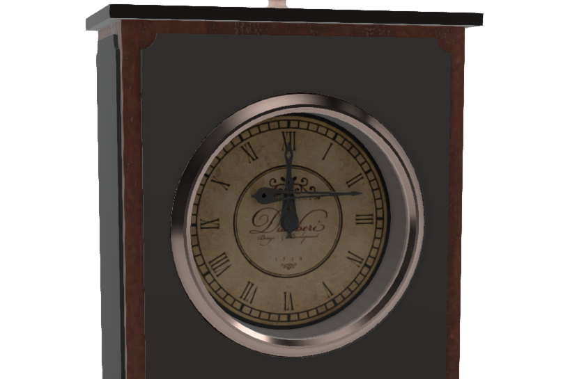
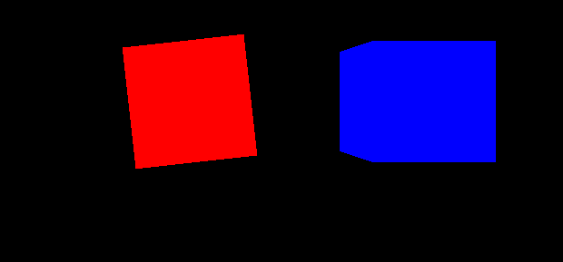
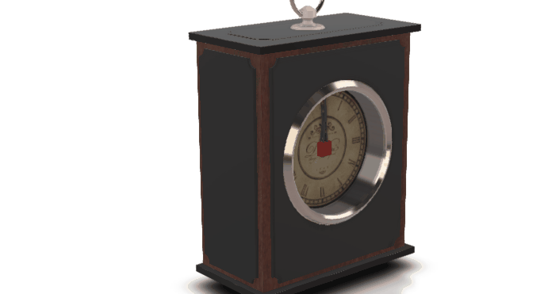
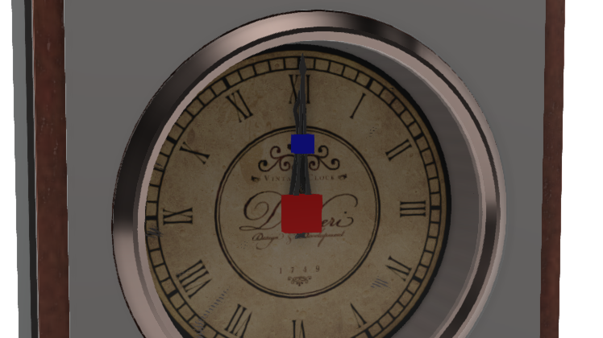
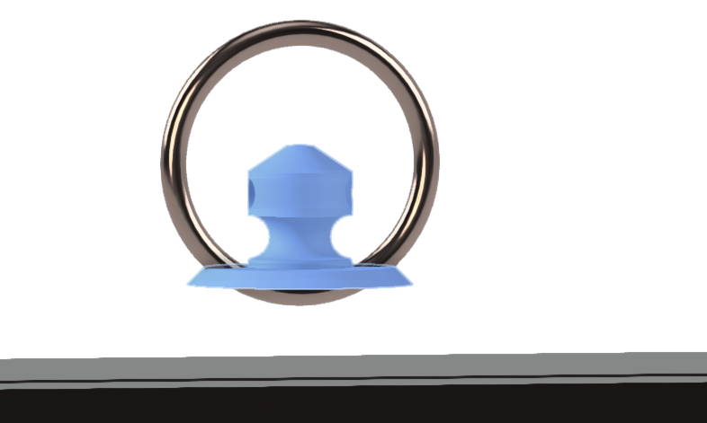

# Three.js parent child relation in Autodesk Forge

In some of our previous blog posts we touched the idea of component translation and rotation. More complex transformations, like rotation of one component around another one, are usually accompanied by frustration with translation/rotation matrices, matrix inverses, quaternions and other fun stuff that rapidly gets out of hand in case of more complex hierarchical transformations. 

In this 2 parts post, I will present another approach:

In the first part of this tutorial, I will explain the basics of the proposed approach along with an illustration on a very simple model. You can see the expected result [here](http://sample-collection.s3-website-us-east-1.amazonaws.com/WoodenWatch.html).

In the second part, I will present how this approach can be applied for more complex transformations and all that will be illustrated on a more complex model. The expected result can be observed [here](http://sample-collection.s3-website-us-east-1.amazonaws.com/GiroWatch.html).


To illustrate the proposed approach, I will start with a fairly simple model of desk clock:


and you can see that the hours, minutes and seconds arms of the clock are grouped at 12 o'clock and fail to expose the beauty or ugliness of their design and their integration in the overall design.

Wouldn't be wonderful to have this model display the current time right in the Viewer? An excellent requirement for an online clock shop using the Viewer for illustration of available beauties.

After briefly examining the model, we can see that the task of showing the current time can be translated as "rotate *HourArm*, *MinuteArm* and *SecondsArm* components around *pin* component (based on some data, but this is not important now).

Based on experience of previous blog posts and some samples, the course of actions would be the following:


1. Get the NodeId of needed component:

    The NodeId of a needed component can be found by selecting that component and calling the ```viewer.getSelection()``` in the console, but for our purpose, based on knowledge from [Get all database id's in the model](https://forge.autodesk.com/cloud_and_mobile/2016/10/get-all-database-ids-in-the-model.html) post, this could be achieved be creating a helper function like this:

    ```javascript
    function findNodeIdbyName(name) {
        let nodeList = Object.values(tree.nodeAccess.dbIdToIndex);
        for (let i = 0, len = nodeList.length; i < len; ++i) {
            if (tree.getNodeName(nodeList[i]) === name) {
                return nodeList[i];
            }
        }
        return null;
    }
    ```

1. Get the fragments and fragment proxy corresponding to a node:

    This is usually achieved with a following code:
    ```javascript

    let tree = viewer.model.getData().instanceTree

    tree.enumNodeFragments(nodeId, function (frag) {
        let fragProxy = viewer.impl.getFragmentProxy(viewer.model, frag);

        //do some work with fragment proxy

    });
    ```

1. Get transforms for each fragment proxy, modify them and "commit" the changes:

    ```javascript
    ...
    fragProxy.getAnimTransform();
    fragProxy.position = some_new_position;
    fragProxy.quaternion = some_new_rotation;
    fragProxy.updateAnimTransform();
    ...
    ```

1. Update the scene, by calling ```viewer.impl.sceneUpdated(true);```


Thus, for our example, to rotate (around X axis) the *SecondsArm*, the code would look something like:
```javascript
let secondsArm_Id = findNodeIdbyName('SecondsArm');
let tree = viewer.model.getData().instanceTree;

tree.enumNodeFragments(secondsArm_Id, function (frag) {
    var fragProxy = viewer.impl.getFragmentProxy(viewer.model, frag);
    fragProxy.getAnimTransform();
    fragProxy.quaternion = new THREE.Quaternion().setFromAxisAngle(
                                    new THREE.Vector3(1,0,0), 
                                    -Math.PI/2);
    fragProxy.updateAnimTransform();
});

viewer.impl.sceneUpdated(true);

```

Thus, the result of strightforward (90 degrees) rotation of the *SecondsArm* will result in something like this:




As you can see, component rotation is not a big deal, but the problem is that the rotation is around its "gravity center", while we would like to rotate it around another axis, and in our example we are lucky that it is just around X axis, at *pin* coordinates.

In this case, any self respecting book on computer graphics will tell you that it is basically calculation of its new translation and rotation, and this is where the fun with translation matrix, rotation matrix and inverses come into play and the natural course of action is to abstract all this and come up with a system.

The funny thing is that sooner or later you'll realize that you are building your [" ... own theme park, with blackjack and ..."](http://www.imdb.com/title/tt0756891/quotes), while all this already exists in three.js library upon which Autodesk Viewer is based.

It is true, that your model is not integrated into three.js scene as you might expect, but this doesn't mean that we cannot use indirectly it's "logic".

To better illustrate my point, let us start with a fairly simple three.js example, based on [Three.js getting Started project](https://threejs.org/docs/#manual/introduction/Creating-a-scene):



In this very example both cubes were added to the scene (to the root node), the red one right in "the center of the Universe", while the blue one somewhere in the world:

```javascript
...

scene.add(red_cube);
scene.add(blue_cube);

camera.position.z = 5;
blue_cube.position.x = 2;

var animate = function () {
    requestAnimationFrame(animate);

    red_cube.rotation.z += 0.01;

    renderer.render(scene, camera); 
};

...
```

Now, what it takes to rotate the the blue cube around the red one?
Just one line:

```javascript
...
    scene.add(red_cube);
    // scene.add(blue_cube);
    red_cube.add(blue_cube);
...

```

which give us:


Thus, instead of adding the blue cube to the scene "directly", we add it "indirectly" by adding it to the red one, thus creating a parent-child relation, where the red cube is the parent, while the blue one is a child, and all subsequent transformations on parent will influence its dependents.


Yeah, good to know, but how this could be useful in our case?

In one of our old [posts](https://forge.autodesk.com/cloud_and_mobile/2015/01/add-geometry-with-autodesk-view-data-api-by-threejs.html), and in [a newer one](https://forge.autodesk.com/blog/adding-custom-lines-forge-viewer-scene) we illustrated how to add three.js objects to Viewer's scene. 

Now guess what happens if we add another object, not to the scene, but as a child to the first one.

Obviously the parent-child relation is working in the Viewer for the three.js objects, but how this can be useful?

Well, we cannot assign a component of our model to be a child of three.js object, but we can easily read the three.js transformation data and assign the needed ones to our model.

In other words, to rotate the SecondsArm component around the Pin component, we can do the following:

1. create an empty three.js object and add it to the Viewer scene. Let us call it *pivot_seconds* object:

    For debugging purposes we will assign it a geometry and a material, just to illustrate it's position in our viewer, but in the end we can just create a ```new THREE.Mesh()``` to make it "invisible"
    ```javascript

    let seconds_pivot = new THREE.Mesh(
                            new THREE.BoxGeometry(10, 10, 10),
                            new THREE.MeshBasicMaterial({ color: 0xff0000 }));


    viewer.impl.scene.add(seconds_pivot);

    ```

    

1. move the pivot_seconds object to same position as Pin component position:
    
    For that, we will need to get the current pin position, which could be abstracted as:

    ```javascript
    function getFragmentWorldMatrixByNodeId(nodeId) {
        let result = {
            fragId: [],
            matrix: [],
        }
        tree.enumNodeFragments(nodeId, function (frag) {

            let fragProxy = viewer.impl.getFragmentProxy(viewer.model, frag);
            let matrix = new THREE.Matrix4();

            fragProxy.getWorldMatrix(matrix);

            result.fragId.push(frag);
            result.matrix.push(matrix);
        });
        return result;
    }

    //some nodes might contain several fragments, but in our case we know it has one fragment

    let pin_position = getFragmentWorldMatrixByNodeId(pin_Id).matrix[0].getPosition().clone();
    seconds_pivot.position.x = pin_position.x;
    seconds_pivot.position.y = pin_position.y;
    seconds_pivot.position.z = pin_position.z;

    ```
    
    And we have it exactly where we needed:

     


1. add another empty three.js object and add it to the pivot_seconds object. Let us call it *seconds_helper*, as it helps us to get the needed position for the *SecondsArm*:
    ```javascript
    let seconds_helper = new THREE.Mesh(
                                new THREE.BoxGeometry(5, 5, 5),
                                new THREE.MeshBasicMaterial({ color: 0x0000ff }));
    let secondsArm_position = getFragmentWorldMatrixByNodeId(secondsArm_Id).matrix[0].getPosition().clone();
    seconds_helper.position.x = secondsArm_position.x;
    seconds_helper.position.y = secondsArm_position.y;
    seconds_helper.position.z = secondsArm_position.z;
    ```
    Here comes the most important part:
    If we add *seconds_helper* directly to the scene by calling ```viewer.impl.scene.add(seconds_helper)```:

    

    by using a simple debugging piece of code:
    ```javascript
    console.log("Pin position = " + JSON.stringify(seconds_pivot.position));
    console.log("SecondsArm position = " + JSON.stringify(secondsArm_position));
    console.log("Helper position = " + JSON.stringify(seconds_helper.position));
    ```

    we can investigate the positions:

    ```
    Pin position = {"x":15.75,"y":-11.25,"z":-0.0030820071697235107}
    SecondsArm position = {"x":19.25,"y":7.5,"z":0}
    Helper position = {"x":19.25,"y":7.5,"z":0}
    ```

    Our helper will be at *SecondsArm* component's position, but it wouldn't be much of help.

    On the other hand, if we add it as a child of the *seconds_pivot* , by calling ```seconds_pivot.add(seconds_helper);``` we end up with something different than expecting:

    
   

    If we check the debug output, we get the same positions as before, but the catch is that in case of *seconds_helper*, that position is relative to is parent. To see its world position, the following debugging snippet will help:

    ```javascript
    seconds_pivot.updateMatrixWorld();
    var seconds_helper_wold_position = new THREE.Vector3();
    seconds_helper.localToWorld(seconds_helper_wold_position);
    console.log("Helper's World position = " + JSON.stringify(seconds_helper_wold_position));
    ```

    which give us the world position:
    ```
    Helper's World position = {"x":35,"y":-3.75,"z":-0.0030820071697235107}
    ```

    As you can see, that's explains why the blue box is not at expected coordinates.
    From this point there are several ways to approach this, but the one that I'm using is through creation of :

    Let us look at the offset - the distance between the needed component and the wanted pivot, which in our case would be: 

    >|          | Pin position  | SecondArm position | Offset  |
    >|----------|:-------------:|-------------------:|--------:|
    >| X        |  15.75        |   19.25            | 3.5     |
    >| Y        |  -11.25       |   7.5              | 18.75   |
    >| Z        | ~ 0           |    ~ 0             |~ 0      |


    Knowing this offset, the position of our *seconds_helper* would be:

    ``` - [SecondArm position] + [abs(Offset)]```

    Why so complicated?

    The thing is that when you are assigning a new position to a fragment proxy, you are not assigning the World position, but a local one.

    To better illustrate this as a side note, let us assign 10 units to fragments of the "Holder" component and see how it affects the World position:

    

    By calling the scary construction:
    ```javascript
    let Holder_Id = findNodeIdbyName('Holder');
    console.log(JSON.stringify(getFragmentWorldMatrixByNodeId(Holder_Id).matrix[0].getPosition()));
    ```
    we get:
    ```
    {"x":0,"y":81.74999237060547,"z":0}
    ```
    Now using the already mentioned approach and assign 10 to fragment's Y position:

    ```javascript
    let secondsArm_Id = findNodeIdbyName('SecondsArm');
    let tree = viewer.model.getData().instanceTree;

    tree.enumNodeFragments(Holder_Id, function (frag) {
        var fragProxy = viewer.impl.getFragmentProxy(viewer.model, frag);
        fragProxy.getAnimTransform();
        fragProxy.position.y = 10
        fragProxy.updateAnimTransform();
    });

    viewer.impl.sceneUpdated(true);
    ```
    we moved the component up:

    

    and it's world position now changed to 
    ```
    {"x":0,"y":91.74999237060547,"z":0}
    ```

    Thus, the fragment proxy's transformations are just "portals" to modify the component's world position and not to set it (this is whay it is called a proxy after all).


    Now, back to our "offset thing". As I said, knowing this offset, the position of our *seconds_helper* would be:

    ``` - [SecondArm position] + [abs(Offset)]```

    or 
    ```javascript
    seconds_helper.position.x = - secondsArm_position.x + Math.abs(secondsArm_position.x - seconds_pivot.position.x);
    seconds_helper.position.y = - secondsArm_position.y + Math.abs(secondsArm_position.y - seconds_pivot.position.y);
    seconds_helper.position.z = - secondsArm_position.z + Math.abs(secondsArm_position.z - seconds_pivot.position.z);
    ```

    which in our debug output will give us
    ```
    PinPivot position = {"x":15.75,"y":-11.25,"z":-0.0030820071697235107}
    SecondsArm component position = {"x":19.25,"y":7.5,"z":0}
    Helper position = {"x":-15.75,"y":11.25,"z":0.0030820071697235107}
    ```

    Why this offset is need, will be explained in the second part of this blog post, where we will deal with complex transformation, but for now just believe me that these are the needed operations.


1. apply *seconds_helper* transforms *SecondsArm* component's transform:
    
    This is done by decomposing the *seconds_helper* transformation into position, scale and rotation(quaternion) and could be stated as a following function:
    
    easily achieved by steps that could be embedded in a following :

    ```javascript
    function assignTransformations(refererence_dummy, nodeId) {
        refererence_dummy.updateMatrixWorld();
        var position = new THREE.Vector3();
        var rotation = new THREE.Quaternion();
        var scale = new THREE.Vector3();
        refererence_dummy.matrixWorld.decompose(position, rotation, scale);

        tree.enumNodeFragments(nodeId, function (frag) {
            var fragProxy = viewer.impl.getFragmentProxy(viewer.model, frag);
            fragProxy.getAnimTransform();
            fragProxy.position = position;
            fragProxy.quaternion = rotation;
            fragProxy.updateAnimTransform();
        });
    }
    ```
    This is the 


    Thus, as we mentioned in the previous step, if we have
    ```
    SecondsArm component position = {"x":19.25,"y":7.5,"z":0}
    ```
    and we assign to fragment proxy the position of the helper
    ```
    Helper position = {"x":-15.75,"y":11.25,"z":0.0030820071697235107}
    ```
    the resulted position 
    ```
    SecondsArm component new position = {"x":3.5,"y":18.75,"z":0.0030820071697235107}
    ```


After looking at all this, many of you might think that those matrix things might not be so scary after all and all this method is quite complicated, thus making this blog useless if not to say more.

These thoughts will dissappear very fast when you realize that after a small setup (whose logic I tried to explain above), further component manipulations like rotation around another component, becomes super easy.

Thus in our case, the only thing we need now, to have the *SecondsArm* component rotate around the Pin component is to call: 

```javascript 
    seconds_pivot.rotation.x = some_value;
    assignTransformations(seconds_helper, secondsArm_Id);
    viewer.impl.sceneUpdated();
```
which can be abstracted further to a single function, but these are already just technicalities.

Back to our clock thing, having setup like this:
```javascript
/* ====================== SECONDS ================= */
let seconds_pivot = new THREE.Mesh();
let pin_position = getFragmentWorldMatrixByNodeId(pin_Id).matrix[0].getPosition().clone();
seconds_pivot.position.x = pin_position.x;
seconds_pivot.position.y = pin_position.y;
seconds_pivot.position.z = pin_position.z;

let seconds_helper = new THREE.Mesh();
let secondsArm_position = getFragmentWorldMatrixByNodeId(secondsArm_Id).matrix[0].getPosition().clone();
seconds_helper.position.x = - secondsArm_position.x + Math.abs(secondsArm_position.x - seconds_pivot.position.x);
seconds_helper.position.y = - secondsArm_position.y + Math.abs(secondsArm_position.y - seconds_pivot.position.y);
seconds_helper.position.z = - secondsArm_position.z + Math.abs(secondsArm_position.z - seconds_pivot.position.z);

viewer.impl.scene.add(seconds_pivot);
seconds_pivot.add(seconds_helper);
```

It is very easy to make the SecondsArm component show the almost realtime seconds:
```javascript
setInterval(function () {
    var timing = new Date();

    seconds_pivot.rotation.x = -1 * timing.getSeconds() * 2 * Math.PI / 60;
    assignTransformations(seconds_helper, secondsArm_Id);
    viewer.impl.sceneUpdated();

}, 1000);

```
That's it!
By repeating same steps for MinuteArm and HourArm, you will have a model of a desk clock showing a real time, as illustrated [here](http://sample-collection.s3-website-us-east-1.amazonaws.com/WoodenWatch.html).

Now you should have the necessary ingredients to make you models even more appealing, by embedding small animations or functionality illustrations. At least a clock shop is ready to go. 

At this step, some of you may still look skeptical at this approach and wonder what it is a big deal about it, as it is not much easier than just creating a matrix out of 3 matrices. Don't worry, you are perfectly right ... at some extent ... that till you have to deal with a more complex chained transformations and to illustrate this, I invite you to reinforce our knowledge on a more complex model in second part [Chained transforms]() post.


