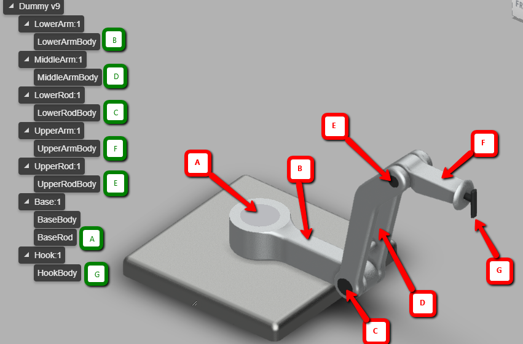
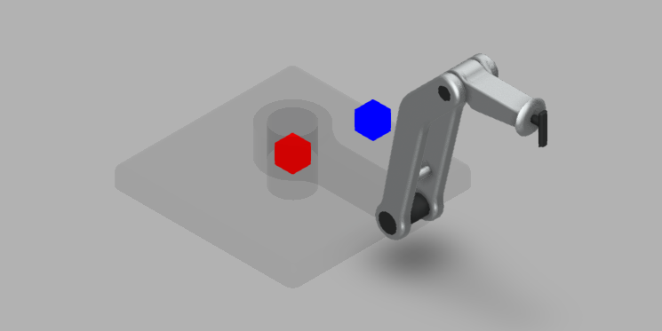

# Hierarchical transformations
In part 1 of this series, we discussed about basics of component transformations using three.js, while in this part we will see how the presented approach can be applied to a more complex hierarchical transformations.

To illustrate this, I will use a fairly old, yet useful simple model of a 4DOF robotic arm, that in my opinion is an excellent example of how model's components could hierarchically depend on another's position creating a sort of dependecy link.

As in [previous part](), the code abstraction will be reduced to the minimum for sake of simplicity and since, what you see is what you have, it is also open for different "on fly" manipulations and experimentations. 

Moreover, this model contains 2 design errors (positional missalignments), so the reduced code abstraction will allow me to demonstrate along the way, how these kind of "mistakes" can be easily corrected "on the fly", a minor thing that might be critical in situations when you don't have access to the "original" model and a very important use case to keep in mind if you are condidering abstracting all this code into a simple library or a framework.

In previous part, we had a desk clock model and we managed to implement basic rotations of the seconds, minutes and hour arms by having 3 independent pivots.

This model, on the other hand, contains 7 components needed to be transformed and the transformation of some components is influenced and might influence others, forming a sort of dependency tree:

    A
    -B
    -C
     -D
     -E
       -F
       -G

In other words, if (for example) component E is transformed (in our case rotated), then it should affect the position/orientation of its depencies F and G. Obiously, any transformation propagated to E is also propagated to its dependents



In this model we 4 axis, so we have to rely on 4 pivots that will be positioned at A, C, E and G. 
After [previous post]() the start should be simple, create a pivot at position of A component and a helper (taking into consideration the offset) which will be responsible for adjusting the "linked" B component:

```javascript
let Pivot_BaseRod = new THREE.Mesh(new THREE.BoxGeometry(5, 5, 5), 
                                   new THREE.MeshBasicMaterial({ color: 0xff0000 }));
let Position_BaseRod = getFragmentWorldMatrixByNodeId(ID_BaseRod).matrix[0].getPosition().clone();
Pivot_BaseRod.position.x = Position_BaseRod.x;
Pivot_BaseRod.position.y = Position_BaseRod.y;
Pivot_BaseRod.position.z = Position_BaseRod.z;
viewer.impl.scene.add(Pivot_BaseRod);


let Helper_LowerArmBody = new THREE.Mesh();
let Position_LowerArmBody = getFragmentWorldMatrixByNodeId(ID_LowerArmBody).matrix[0].getPosition().clone();
Helper_LowerArmBody.position.x = - Position_LowerArmBody.x + Math.abs(Position_LowerArmBody.x - Pivot_BaseRod.position.x);
Helper_LowerArmBody.position.y = - Position_LowerArmBody.y + Math.abs(Position_LowerArmBody.y - Pivot_BaseRod.position.y);
Helper_LowerArmBody.position.z = - Position_LowerArmBody.z + Math.abs(Position_LowerArmBody.z - Pivot_BaseRod.position.z);
Pivot_BaseRod.add(Helper_LowerArmBody);
```

Giving the expected (for those who looked at the previous article) positions:




However, what about the subsequent components?

The overall algorithm here is fairly simple, for each axis, create a pivot and for each component, create a helper linked to the needed axis.

However, there is one thing we have to keep in mind and it has to do with offset we briefly mentioned in the [previous part]().

The offset for the first handler is simple, as it takes into consideration just the pivot position, but in case of a handler depending on a pivot that depends on another pivot (as in this case D depends on C, which dependes on A), the sitaution complicates, but not very much:
```javascript
let Pivot_LowerRodBody = new THREE.Mesh();
let Position_LowerRodBody = getFragmentWorldMatrixByNodeId(ID_LowerRodBody).matrix[0].getPosition().clone();

Pivot_LowerRodBody.position.x = Position_LowerRodBody.x - Pivot_BaseRod.position.x;
Pivot_LowerRodBody.position.y = Position_LowerRodBody.y - Pivot_BaseRod.position.y;
Pivot_LowerRodBody.position.z = Position_LowerRodBody.z - Pivot_BaseRod.position.z;
Pivot_BaseRod.add(Pivot_LowerRodBody);

let Helper_LowerRodBody = new THREE.Mesh();
Helper_LowerRodBody.position.x = - Position_LowerRodBody.x + Math.abs(Position_LowerRodBody.x - Pivot_LowerRodBody.position.x - Pivot_BaseRod.position.x);
Helper_LowerRodBody.position.y = - Position_LowerRodBody.y + Math.abs(Position_LowerRodBody.y - Pivot_LowerRodBody.position.y - Pivot_BaseRod.position.y);
Helper_LowerRodBody.position.z = - Position_LowerRodBody.z + Math.abs(Position_LowerRodBody.z - Pivot_LowerRodBody.position.z - Pivot_BaseRod.position.z);
Pivot_LowerRodBody.add(Helper_LowerRodBody);
```

As you can see, here we have two relatively new things:

- When creating a pivot that depends on another pivot (pivot child of the another pivot), we have to place it at rotation point, but keep into consideration that it's position is related to parent and not the World, so we have to substract the parent's position.
For example for pivot corresponding to component E, we have to take into consideration the position of component E, pivot coresponding to C and the one corresponding to A:
:
```javascript
...

let Pivot_UpperRodBody = new THREE.Mesh();
  let Position_UpperRodBody = getFragmentWorldMatrixByNodeId(ID_UpperRodBody).matrix[0].getPosition().clone();

  Pivot_UpperRodBody.position.x = Position_UpperRodBody.x - Pivot_LowerRodBody.position.x - Pivot_BaseRod.position.x;
  Pivot_UpperRodBody.position.y = Position_UpperRodBody.y - Pivot_LowerRodBody.position.y - Pivot_BaseRod.position.y;
  Pivot_UpperRodBody.position.z = Position_UpperRodBody.z - Pivot_LowerRodBody.position.z - Pivot_BaseRod.position.z;
  Pivot_LowerRodBody.add(Pivot_UpperRodBody);
...
```

- Another thing is related to helpers. If for direct helpers (those depending on root pivot), we took into consideration just the offset from pivot position, then now we have to "accumulate" these offsets:
```javascript
...

let Helper_UpperRodBody = new THREE.Mesh();

Helper_UpperRodBody.position.x = - Position_UpperRodBody.x + Math.abs(Position_UpperRodBody.x - Pivot_UpperRodBody.position.x - Pivot_LowerRodBody.position.x - Pivot_BaseRod.position.x);
Helper_UpperRodBody.position.y = - Position_UpperRodBody.y + Math.abs(Position_UpperRodBody.y - Pivot_UpperRodBody.position.y - Pivot_LowerRodBody.position.y - Pivot_BaseRod.position.y);
Helper_UpperRodBody.position.z = - Position_UpperRodBody.z + Math.abs(Position_UpperRodBody.z - Pivot_UpperRodBody.position.z - Pivot_LowerRodBody.position.z - Pivot_BaseRod.position.z);
Pivot_UpperRodBody.add(Helper_UpperRodBody);

...
```


