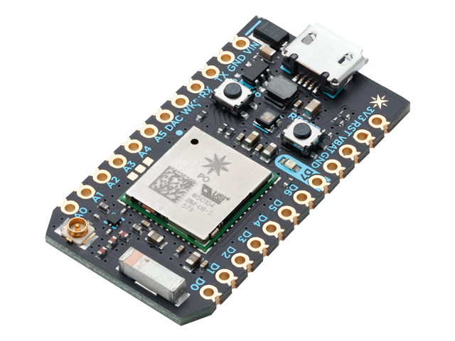
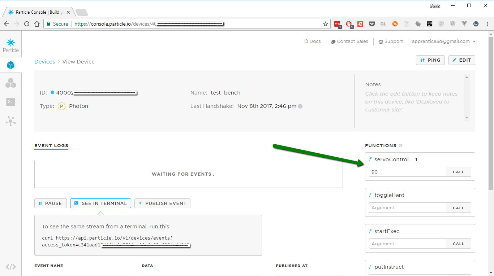
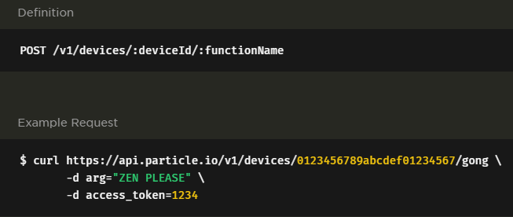
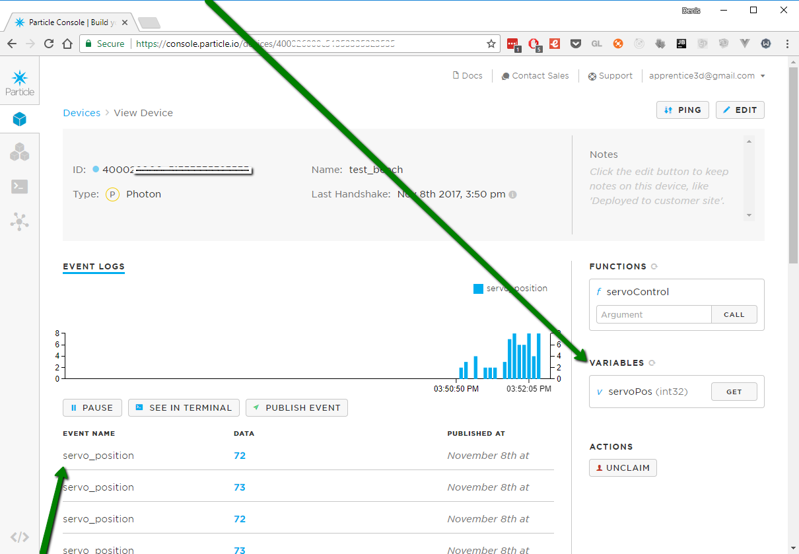

## Fusion Viewer and IoT

In my free time, I am playing with different IoT related things, like servos, sensors, building robots or even mini SAM (Surface-to-air missile) systems and other interesting things. What strikes me is that all the UI for these things is somehow stuck in ‘90s, with terminal input/output, which is nice (I like old-school), but maybe we can do more about it?
From my knowledge, except Qt’s endeavours in promoting QML (and not only) (https://www.qt.io/qt-in-iot/) in building UI for IoT devices, there are not so many options around and I think that Forge Platform could help improving this situation through its Forge Viewer.

Let us think of a very simple scenario of controlling a servo motor and think of replacing the classic typing a value in a terminal (that will be read by a microcontroller, usually through use of serial communication) and replace with something like this:


We could also have the 3D model reflect the position of the real servo (changed by a potentiometer) or maybe even go further and explore the idea of “animation programming”, where we animate the 3D model of servo motor and flash the microcontroller with derived code to have the real servo repeat the animation sequence. 


Thus, in what follows we will try to:

1.	Add some basic transformation to some of model’s components;

2.	Add some simple transformations controls for our 3D model;

3.	Link 3D model transformations to real servo motor;

4.	Control 3D model by manipulating the servo motor;

5.	Add key animation functionality to 3D model;

6.	Program the real servo by animating the 3D model.

The idea behind first two steps is described in more details in my other [blog series](https://forge.autodesk.com/blog/know-how-complex-component-transformations-viewer-part-1-basics), but to keep it consistent I will briefly reiterate some if it in this new context.

 ### 1. Implement basic transformation for some model’s components
In our setup, we have a model with 3 independent parts: servo motor, handle and a fixing screw.  
For illustration of servo work, we would like that handle and the fixing screw rotate around the servo’s tip. In other words, the servo tip should be the pivot (rotation point) for servo handle and the fixing screw.
For those familiar with mentioned transformation series, this would be quite easy to implement:  

-	Create a three.js object at pivot location and add it to the scene:
    ```javascript
    let Pivot_ServoTip = new THREE.Mesh();
    let Position_ServoTip = getFragmentWorldMatrixByNodeId(ID_ServoTip).matrix[0].getPosition().clone();
    Pivot_ServoTip.position.x = Position_ServoTip.x;
    Pivot_ServoTip.position.y = Position_ServoTip.y;
    Pivot_ServoTip.position.z = Position_ServoTip.z;
    viewer.impl.scene.add(Pivot_ServoTip);
    ```

-	Create three.js objects at position of object to be rotate, relative to the rotation point and add these object as child of the above created “pivot” three.js object:
    ```javascript
    let Helper_Fixer = new THREE.Mesh();
    let Position_Fixer = getFragmentWorldMatrixByNodeId(ID_Fixer).matrix[0].getPosition().clone();
    Helper_Fixer.position.x = - Position_Fixer.x + Math.abs(Position_Fixer.x - Pivot_ServoTip.position.x);
    Helper_Fixer.position.y = - Position_Fixer.y + Math.abs(Position_Fixer.y - Pivot_ServoTip.position.y);
    Helper_Fixer.position.z = - Position_Fixer.z + Math.abs(Position_Fixer.z - Pivot_ServoTip.position.z);
    Pivot_ServoTip.add(Helper_Fixer);

    let Helper_Handle = new THREE.Mesh();
    let Position_Handle = getFragmentWorldMatrixByNodeId(ID_Fixer).matrix[0].getPosition().clone();
    Helper_Handle.position.x = - Position_Handle.x + Math.abs(Position_Handle.x - Pivot_ServoTip.position.x);
    Helper_Handle.position.y = - Position_Handle.y + Math.abs(Position_Handle.y - Pivot_ServoTip.position.y);
    Helper_Handle.position.z = - Position_Handle.z + Math.abs(Position_Handle.z - Pivot_ServoTip.position.z);
    Pivot_ServoTip.add(Helper_Handle);
    ```

-	To rotate the components, rotate the “pivot” three.js object, read the transformations of its child three.js objects and apply these transformations to the corresponding components:
    ```javascript
    Pivot_ServoTip.rotation.y = some_value * Math.PI / 180;
    assignTransformations(Helper_Fixer, ID_Fixer);
    assignTransformations(Helper_Handle, ID_Handle);
    ```
    where
    ```javascript
    function assignTransformations(refererence_dummy, nodeId) {
        refererence_dummy.parent.updateMatrixWorld();
        let position = new THREE.Vector3();
        let rotation = new THREE.Quaternion();
        let scale = new THREE.Vector3();
        refererence_dummy.matrixWorld.decompose(position, rotation, scale);

        tree.enumNodeFragments(nodeId, function (frag) {
            let fragProxy = viewer.impl.getFragmentProxy(viewer.model, frag);
            fragProxy.getAnimTransform();
            fragProxy.position = position;
            fragProxy.quaternion = rotation;
            fragProxy.updateAnimTransform();
        });
    }
    ```


Nothing fancy and it might even look overcomplicated, especially for this case, but this approach allows us to easily deal with very complex transformations and avoid reinventing the wheel and dealing with matrix operations.

### 2.	Link transformations controls to 3D model;
To facilitate the use of Rotate(angle) function, it would be nice to have it linked to some gui, and (at least for me) the fastest way of creating a gui prototype is use of [dat.js library](https://workshop.chromeexperiments.com/examples/gui/#1--Basic-Usage):

```javascript
let gui = new dat.GUI({ autoPlace: false });
document.getElementById("MyControls").append(gui.domElement);


let GiroController = function () {
    this.ServoRotation = 0;
}

box_control = new GiroController();

let ServoRotation = gui.add(box_control, 'ServoRotation', 0, 180);

ServoRotation.onChange(function (value) {
    Pivot_ServoTip.rotation.y = value * Math.PI / 180;
    assignTransformations(Helper_Fixer, ID_Fixer);
    assignTransformations(Helper_Handle, ID_Handle);

    viewer.impl.sceneUpdated(true);
});
```

In this way, we can easily manipulate the slider and have the model reflect the expected behaviour:


### 3.	Link 3D model transformations to real servo motor
I will not get here into details of [how a servo works](https://learn.adafruit.com/adafruits-raspberry-pi-lesson-8-using-a-servo-motor/servo-motors), what is [PWM](https://learn.sparkfun.com/tutorials/pulse-width-modulation) or other interesting things. In our case it suffice to know that, no matter what micro controller you use, it will have means in form of [a library](https://www.arduino.cc/en/Reference/Servo) to abstract the low level things into something like ```servo.write(90)``` that will rotate servo arm to 90 degrees.

For this illustration I will use the [Particle Photon](https://www.particle.io/products/hardware/photon-wifi-dev-kit) 



only because it comes with a ready cloud infrastructure, allowing to create functions 

```javascript

...

Servo test_servo;
int servo_pin = A4;

void setup() {
    
    test_servo.attach(servo_pin);

    Particle.function("servoControl", servoExternalControl);

}


void loop() {
}

int servoExternalControl(String command) {
    int new_position = command.toInt();
    servo_position = constrain(new_position, 0 , 180);
    test_servo.write(servo_position);
    
    return 1;
}


```

that can be remotely invoked either on their portal:



 or through use of [REST API](https://docs.particle.io/reference/api/):



Having this cloud ready infrastructure and the remotely invocable function, it is very easy to integrate it into our project by abstracting it and calling its abstraction whenever the rotation slider connected to our 3D model is changed, changing both, the 3D servo and the real servo:

```javascript
function setRealServo(value) {
    fetch("https://api.particle.io/v1/devices/400026000cxxxx3335323535/servoControl", {
        method: "POST",
        body: "access_token=c341aad18d1xxxxxxx94ee30a6a95e606fa4a219&args=" + String(180 - value),
        headers: {
            "Content-Type": "application/x-www-form-urlencoded"
        }
    }).then(function (res) {
        console.log(res);
    })
}

// use it within
ServoRotation.onFinishChange(function (value) {
        setRealServo(180 - value);
});
```

Note here that we are not sending remote commands upon "realtime" slider change, but merely when the slider change is finished. This allows reducing the number of api calls, otherwise it will keep continuously call the ```servoControl``` endpoint and since nobody guarantees you that the order you call the endpoint will be the same upon receiving and execution, the servo might behave somehow frenetically. 


### 4.	Control 3D model by manipulating the servo motor

As we previously mentioned, going even further, it would be nice to have the inversed controls, where we would have a potentiometer controlling the real servo rotation, and upon which it will rotate the 3D model too.  
At micro controller level this seems to be trivial: 

• read in loop the analog value coming from pin associated to potentiometer:

•	map analog value to servo position;

•	rotate servo to the new position;

•	publish the new servo position

```javascript
...
int servo_position = 0;
int potiontiometer = A0;

int analogvalue;

void setup() {
    
    ...
    pinMode(potiontiometer,INPUT);  

    //this will expose the servo position var for external query
    Particle.variable("servoPos", &servo_position, INT);
    ...
}

void loop() {
    analogvalue = analogRead(potiontiometer);
    
    servo_position = analogvalue*max_servo/max_potention;
    servoControl(servo_position);
}
```

Notice that we expose the servo position through 
```javascript 
Particle.variable("servoPos", &servo_position, INT);
``` 

that will allow query it through portal or through an endpoint



Also, there is a way of publishing the value:

```javascript
Particle.publish("servo_position", String(servo_position), PRIVATE);
```

which creates an event that can be linked to a webhook and allow us to be notified upon servo_position/potiontiometer change. 


In our case, since we would like to keep it simple, so we will just periodically call the servoPos and change the 3D model position accordingly:

```javascript
let servo_position = 0;

function getRealServoPosition() {
    fetch("https://api.particle.io/v1/devices/400026xxx5/servoPos?access_token=c34xxx").
        then(function (res) {
            return res.json();
        }).then(function (data) {
            servo_position = data["result"] || servo_position;
            ServoRotation.setValue(servo_position);
        })
}

//we can set to have it periodically read and change the servo position
setInterval(function(){
    getRealServoPosition();
                    }, 500);

```

### 5.	Add key animation functionality to 3D model;